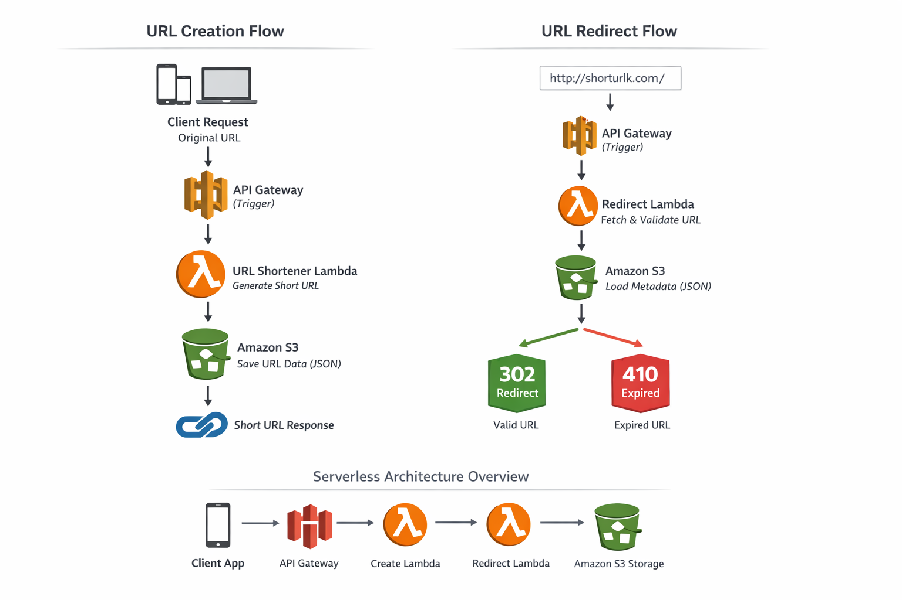

# 🌐 Serverless URL Shortener Architecture

<p align="center">
  
  
  
  
</p>

> **Distributed, cloud-native URL shortener system built with Serverless architecture**, designed for scalability, cost-efficiency, and high availability.

---

## 🚀 Overview

This project represents a **complete URL shortening ecosystem**, composed of two independent serverless services:

- 🔗 **URL Creation Service** → Generates shortened URLs  
- 🔁 **Redirect Service** → Resolves and redirects URLs  

Both services are fully decoupled and communicate through **Amazon S3**, following a **stateless and event-driven architecture**.

---

## 🧩 Repositories

### 🔗 URL Shortener (Write Service)

Handles URL creation and persistence:

👉 https://github.com/Maruka13/serverless-url-shortener

- Generates unique short codes (UUID)
- Stores metadata in S3
- Defines expiration time (TTL)

---

### 🔁 Redirect Service (Read Service)

Handles URL resolution and redirection:

👉 https://github.com/Maruka13/serverless-redirect-lambda

- Retrieves data from S3
- Validates expiration
- Performs HTTP redirect (302 / 410)

---

## 🧠 System Architecture

```
        ┌───────────────┐
        │   Client App  │
        └──────┬────────┘
               │
               ▼
        ┌───────────────┐
        │ API Gateway   │
        └──────┬────────┘
               │
     ┌─────────┴─────────┐
     ▼                   ▼
┌──────────────┐   ┌──────────────┐
│ URL Creator  │   │ URL Redirect │
│  (Lambda)    │   │   (Lambda)   │
└──────┬───────┘   └──────┬───────┘
       │                  │
       └──────┬───────────┘
              ▼
        ┌───────────────┐
        │   Amazon S3   │
        └───────────────┘
```

---

## 🧠 Architecture Overview


---

## 🔎 Request Flow

### 🔗 URL Creation

1. Client sends original URL  
2. Lambda generates UUID  
3. Data stored in S3 (JSON)  
4. Short URL returned  

---

### 🔁 URL Redirection

1. Client accesses short URL  
2. Lambda fetches metadata from S3  
3. Validates expiration  
4. Returns:
   - **302 Redirect** → valid  
   - **410 Gone** → expired  

---

## ✨ Key Design Decisions

- **Serverless First:** No infrastructure management  
- **Stateless Services:** Horizontal scalability  
- **S3 as Storage:** Simple, durable, cost-effective  
- **Decoupled Services:** Independent deployment and scaling  
- **Event-Driven:** Trigger-based execution  

---

## 📈 Scalability

- Auto-scaling via AWS Lambda  
- No concurrency limits at application level  
- S3 supports high-throughput access  

---

## 💰 Cost Optimization

- Pay-per-request model (Lambda)  
- No idle server costs  
- S3 low-cost storage  

---

## 🎯 Use Cases

- URL shortening services  
- Marketing campaign tracking  
- Temporary links (TTL-based)  
- Lightweight redirection systems  

---

## 🧠 Concepts Demonstrated

- Distributed Systems  
- Serverless Architecture  
- Cloud-Native Design  
- Event-Driven Systems  
- Microservices Communication  
- High Availability Systems  

---

## 🤝 Author

**Emanuelle Gomes**

Backend & Cloud Developer focused on building **scalable distributed systems** ☁️🚀
